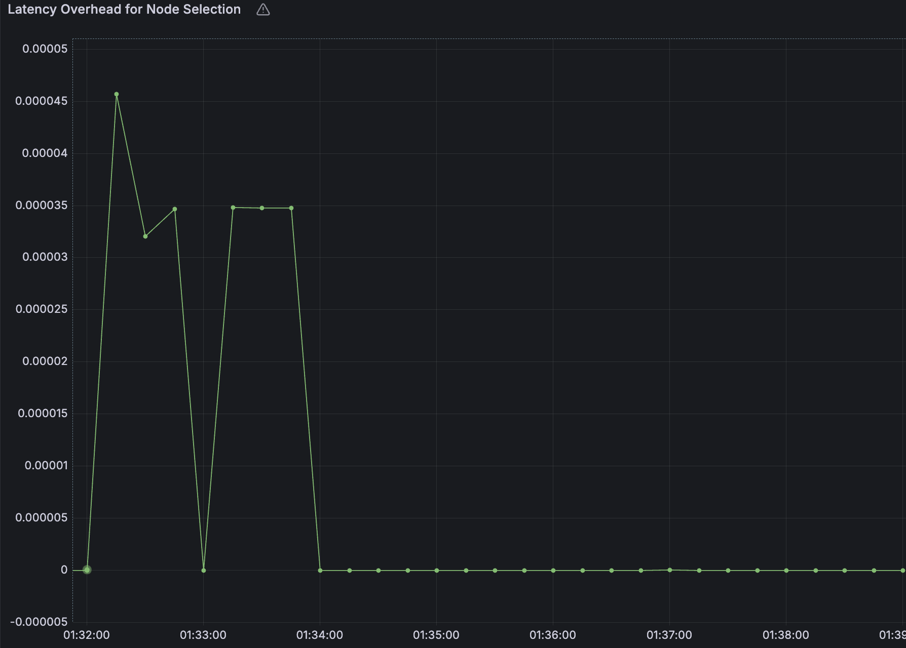

# March 2024 Benchmark (RC 0.2.0)

## Benchmark Purpose

The purpose of this benchmark is to comprehensively assess the performance metrics, particularly CPU and Memory behaviors, incurred while serving requests through the gateway server. Specifically, this evaluation aims to gauge the efficiency of various operations involved with sending a relay such as JSON serialization, IO handling, cryptographic signing, and asynchronous background processes (QoS checks).

## Benchmark Environment

- **POKT Testnet**: The benchmark is conducted within the environment of the POKT Testnet to simulate real-world conditions accurately.
- **RPC Method web3_clientVersion**: The benchmark uses a consistent time RPC method, web3_clientVersion, chosen deliberately to isolate the impact of the gateway server overhead. It's noteworthy that the computational overhead of sending a request to the POKT Network remains independent of the specific RPC Method employed.
- **Gateway Server Hardware**: The gateway server is deployed on a dedicated DigitalOcean droplet instance (16 GB Memory / 8 Prem. Intel vCPUs / 100 GB Disk / FRA1), ensuring controlled conditions for performance evaluation.
- **Tooling**: Utilizes [Vegeta](https://github.com/tsenart/vegeta), a versatile HTTP load testing too
- **Vegeta Server Hardware**: The load tester is deployed on a seperate dedicated DigitalOcean droplet instance (8 GB Memory / 50 GB Disk / FRA1) to prevent any thrashing with the gateway server.
- **Grafana**: Used to visualize Gateway server internal metrics.

## Scripts

Load Testing Command

```sh
vegeta attack -duration=180s -rate=100/1s -targets=gateway_server.config | tee results.bin | vegeta report
```

Vegeta Target

```sh
POST http://{endpoint}
Content-Type: application/json
@payload.json
```

Payload.json

```json
{ "jsonrpc": "2.0", "method": "web3_clientVersion", "params": [], "id": 1 }
```

## Load Test Results

100 RPS

```text
Requests      [total, rate, throughput]         18000, 100.01, 99.87
Duration      [total, attack, wait]             3m0s, 3m0s, 239.445ms
Latencies     [min, mean, 50, 90, 95, 99, max]  170.168ms, 191.573ms, 176.331ms, 200.473ms, 230.392ms, 283.411ms, 3.284s
Bytes In      [total, mean]                     1260000, 70.00
Bytes Out     [total, mean]                     1206000, 67.00
Success       [ratio]                           100.00%
Status Codes  [code:count]                      200:18000
Error Set:
```

500 RPS

```text
Requests      [total, rate, throughput]         90000, 500.01, 499.51
Duration      [total, attack, wait]             3m0s, 3m0s, 176.636ms
Latencies     [min, mean, 50, 90, 95, 99, max]  169.036ms, 182.464ms, 176.267ms, 197.629ms, 212.595ms, 263.593ms, 3.61s
Bytes In      [total, mean]                     6300000, 70.00
Bytes Out     [total, mean]                     6030000, 67.00
Success       [ratio]                           100.00%
Status Codes  [code:count]                      200:90000
Error Set:
```

1000 RPS

```text
Requests      [total, rate, throughput]         180000, 1000.00, 998.87
Duration      [total, attack, wait]             3m0s, 3m0s, 204.308ms
Latencies     [min, mean, 50, 90, 95, 99, max]  168.406ms, 183.103ms, 176.947ms, 190.737ms, 196.224ms, 216.507ms, 7.122s
Bytes In      [total, mean]                     12600000, 70.00
Bytes Out     [total, mean]                     12060000, 67.00
Success       [ratio]                           100.00%
Status Codes  [code:count]                      200:180000
Error Set:
```

## Analysis

### CPU Metrics


CPU metrics exhibit a slight uptick from approximately 10% to around 125% at peak load of 1,000 RPS. However, it's noteworthy that the gateway server did not reach full CPU utilization, with the maximum observed at 800%.

### Ram Metrics


RAM metrics show a similar pattern, with a slight increase from around 120MiB to approximately 280MiB at peak load. This increase is expected due to the opening of more network connections while serving traffic.

### Latency Analysis

Upon closer inspection, despite the tenfold increase in load from 100 RPS to 1,000 RPS, the benchmark latency remained relatively consistent at ~150MS. Nodies, with the gateway server in production, has seen multiple node operators achieve lower latencies, typically ranging from 50ms to 70ms P90 latency at similar or higher request rates. Therefore, a consistent baseline latency of ~150ms at even 100 RPS in our benchmarking environment warranted further investigation to determine root cause.

By analyzing Prometheus metrics emitted by the gateway server, specifically `pocket_relay_latency` (which measures the latency of creating a relay, including hashing, signing, and sending it to POKT Nodes) and `relay_latency` (providing an end-to-end latency metric including node selection), it was possible to identify the source of additional latency overhead.



This deep dive revealed that the bottleneck does not lie in QoS/Node selection, as the intersection of the two metrics indicated that node selection completes within fractions of a second, ruling out that the gateway server code has a bottleneck.

The baseline latency overhead therefore is attributed to protocol requirements (hashing/signing a relay) and hardware specifications. To mitigate this latency, upgrading to more powerful CPUs or dedicated machines should decrease this latency. Nodies currently uses the AMD 5950X CPU for their gateway servers.

### Summary

This benchmark provides a comprehensive quantitative assessment of the gateway server's performance under varying loads within the POKT Testnet environment. Analysis of CPU metrics reveals a slight uptick in CPU utilization from approximately 10% to around 125% at peak load of 1,000 RPS (max capacity of 800%). Memory metrics also show a similar pattern, with memory utilization increasing from around 120MiB to approximately 280MiB at peak load.

Despite the increase in load, the gateway server demonstrates resilience, maintaining consistent latency across different request rates.

In order to achieve better latency performance in production, gateway operators should strive for modern CPU's such as the AMD Ryzen 9 or EPYC processors.
